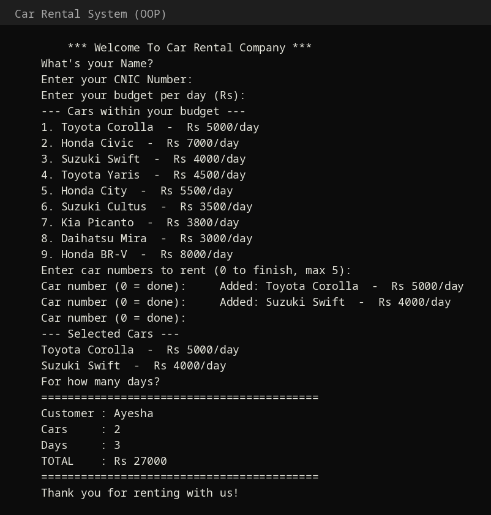

# 🚗 Car Rental System — OOP Edition

My **Object-Oriented Programming (OOP) semester project** — a console-based Car Rental System in C++ demonstrating core OOP concepts.

## 🧠 OOP Concepts Used

| Concept | Where |
|---|---|
| **Encapsulation** | Private members in `Car` & `Customer` with getters |
| **Inheritance** | `Car` inherits from `Vehicle` base class |
| **Polymorphism** | Pure virtual `display()` / `getPrice()` overridden in `Car` |
| **Constructors** | Parameterized constructors, `const` member initialization |
| **File Handling** | Car inventory loaded from `cars.txt` |

## ✨ Features

- 📂 Load car inventory from file
- 💰 Filter cars by daily budget
- ✅ Select up to 5 cars to rent
- 🧾 Automatic bill: total = Σ (rent/day × days)
- 🛡️ Input validation (no crashes on bad input)

## 📁 Project Structure

```
├── main.cpp      # Complete OOP program (Vehicle, Car, Customer, RentalSystem)
├── cars.txt      # Car inventory data (Manufacturer,Model,PricePerDay)
└── screenshots/  # Terminal screenshot
```

## ▶️ How to Run

```bash
g++ -o car_rental_oop main.cpp -std=c++17
./car_rental_oop
```

## 📸 Screenshot



## 🛠️ Tech

- C++17 (console application)

## 👩‍💻 Author

**Ayesha Shoukat** — Computer Science @ UET Narowal
